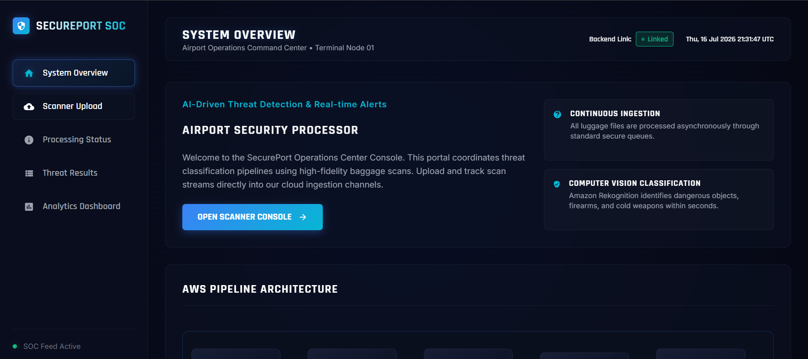
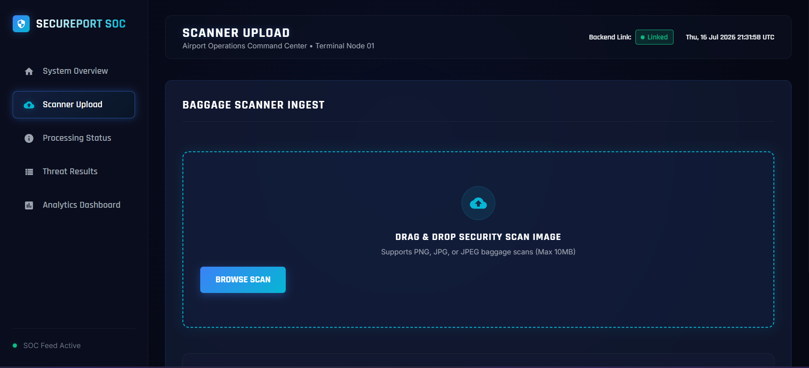
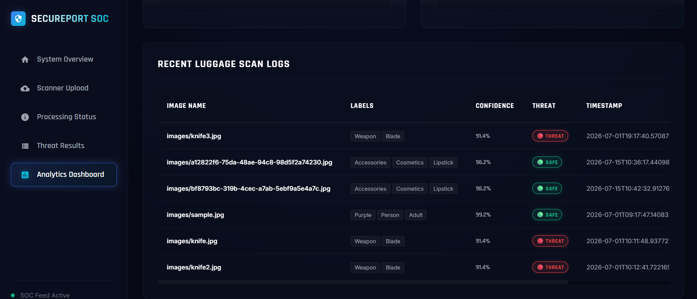
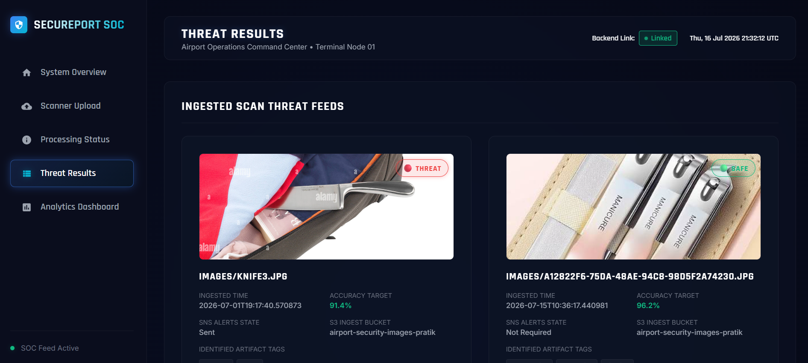

# 🛡️ Airport Security Monitoring System using AWS

A serverless **Airport Security Monitoring System** built on AWS that automatically detects prohibited items from uploaded baggage images using **Amazon Rekognition**. The system analyzes each uploaded image, identifies dangerous objects such as weapons, and displays the security status on a modern web dashboard.

---

# 📖 Project Overview

This project demonstrates an event-driven security monitoring solution using AWS cloud services.

When a security officer uploads a baggage image:

1. The image is uploaded to Amazon S3.
2. Amazon S3 sends an event to Amazon SQS.
3. AWS Lambda is triggered by SQS.
4. Lambda invokes Amazon Rekognition to analyze the image.
5. Detected labels are compared against a predefined list of prohibited items.
6. The security result is stored in Amazon DynamoDB.
7. An email notification is sent using Amazon SNS.
8. The frontend dashboard displays the latest inspection result.

This solution provides an automated baggage screening workflow without requiring a dedicated backend server.

---

# 🚀 Features

- 📷 Upload baggage images
- 🔍 Automatic object detection using Amazon Rekognition
- 🚨 Detect prohibited items such as weapons
- 📊 Display security status and confidence score
- 📧 Email notification using Amazon SNS
- ☁️ Fully serverless AWS architecture
- 📱 Responsive security dashboard
- ⚡ Event-driven image processing

---

# 🛠 Technologies Used

## Frontend
- HTML5
- CSS3
- JavaScript

## AWS Services
- Amazon S3
- Amazon SQS
- AWS Lambda
- Amazon Rekognition
- Amazon DynamoDB
- Amazon SNS
- IAM

---

# 🏗 Architecture

```text
                 +----------------------+
                 | Security Officer     |
                 +----------+-----------+
                            |
                     Upload Baggage Image
                            |
                            ▼
                     Amazon S3 Bucket
                            |
                     S3 Event Notification
                            |
                            ▼
                        Amazon SQS
                            |
                            ▼
                      AWS Lambda
                            |
          +-----------------+-----------------+
          |                                   |
          ▼                                   ▼
 Amazon Rekognition                  Amazon DynamoDB
 Detect Objects                     Store Scan Result
          |
          ▼
     Identify Dangerous Items
          |
          ▼
       Amazon SNS
   Send Email Alert
          |
          ▼
   Frontend Dashboard
```

---

# 📂 Project Structure

```
Airport-Security-System/
│
├── index.html
├── style.css
├── script.js
│
├── lambda/
│   └── lambda_function.py
│
├── screenshots/
│   ├── dashboard.png
│   ├── upload.png
│   ├── analytics.png
│   └── results.png
│
├── README.md
└── requirements.txt
```

---

# ⚙️ Workflow

### Step 1

Security officer uploads a baggage image.

↓

### Step 2

The image is stored in Amazon S3.

↓

### Step 3

Amazon S3 sends an event notification to Amazon SQS.

↓

### Step 4

AWS Lambda is triggered by the SQS message.

↓

### Step 5

Lambda analyzes the image using Amazon Rekognition.

↓

### Step 6

Detected labels are compared with a predefined list of prohibited items.

↓

### Step 7

The inspection result is stored in Amazon DynamoDB.

↓

### Step 8

Amazon SNS sends an email notification with the inspection result.

↓

### Step 9

The frontend dashboard displays the latest scan result.

---

# 📸 Application Screenshots

## Dashboard



## Upload Page



## Analytics



## Results



---

# AWS Services Used

| Service | Purpose |
|----------|----------|
| Amazon S3 | Store uploaded baggage images |
| Amazon SQS | Queue image processing requests |
| AWS Lambda | Analyze uploaded images |
| Amazon Rekognition | Detect prohibited objects |
| Amazon DynamoDB | Store inspection results |
| Amazon SNS | Send security email notifications |
| IAM | Manage permissions between AWS services |

---

# 📁 S3 Bucket Structure

```
airport-security-bucket/
│
├── uploads/
│      bag1.jpg
│      bag2.jpg
│
├── results/
│      latest.json
│      result1.json
```

---

# Example Output

```json
{
  "image": "bag1.jpg",
  "status": "Unsafe",
  "detected_item": "Knife",
  "confidence": 98.76,
  "timestamp": "2026-07-16T11:40:15Z"
}
```

---

# How to Run

## Clone Repository

```bash
git clone https://github.com/your-username/Airport-Security-System.git
```

---

## Open the Project

Launch the frontend by opening:

```
index.html
```

in your browser.

---

## Deploy AWS Resources

Create and configure:

- Amazon S3 Bucket
- Amazon SQS Queue
- AWS Lambda Function
- Amazon Rekognition
- Amazon DynamoDB Table
- Amazon SNS Topic
- IAM Role
- S3 Event Notification

---

# Future Improvements

- 🎥 Live CCTV monitoring
- 📹 Real-time video analysis
- 🤖 AI-based threat classification
- 📊 Security analytics dashboard
- 🌍 Multi-airport deployment
- 📱 Mobile monitoring application
- ☁️ CloudWatch monitoring and alerts

---

# Learning Outcomes

This project helped in understanding:

- Event-driven serverless architecture
- Amazon Rekognition object detection
- Amazon S3 Event Notifications
- Amazon SQS integration
- AWS Lambda processing
- Amazon DynamoDB operations
- Amazon SNS notifications
- IAM roles and permissions
- Frontend integration with AWS services

---

# Author

**Pratik Bhadane**

**GitHub:** https://github.com/pratikBhadane18

**LinkedIn:** https://linkedin.com/in/pratik-bhadane-634817309

---

# ⭐ Support

If you found this project helpful, consider giving it a **Star ⭐** on GitHub!